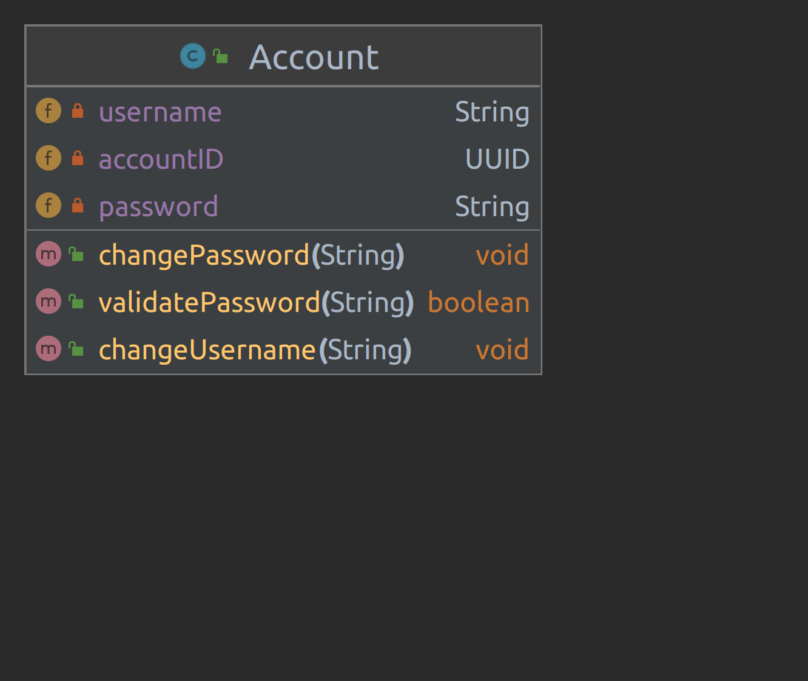

# Third Assignment: Hogwarts School Management System 🧙‍♂️

Welcome to your third Advanced Programming (AP) assignment, where you'll embark on the magical journey of building the Hogwarts School Management System. This project aims to streamline administrative tasks at Hogwarts School of Witchcraft and Wizardry, offering a comprehensive platform for managing teachers, students, and courses within the esteemed institution.

## Prerequisites ✅

Before diving into the enchanting world of Hogwarts, ensure you have the following prerequisites installed on your magical workstation:

- Java 21
- Git
- Gradle as a package manager

## Objectives ✏️

By completing this assignment, you will:

- Reinforce your understanding of Object-Oriented Programming (OOP) principles and apply them effectively (It is highly recommended to read 'Different patterns to design your classes' in the Resource section).
- Gain familiarity with concepts such as encapsulation, inheritance, and polymorphism.
- Hone your skills in designing robust and scalable classes.
- Learn to manage and track changes in your project using Git.

## Tasks 📝

1. Fork this repository and clone it to your local machine.
2. Create a new branch named `develop` and switch to it. All development should be done in this branch.
3. **Complete or create** the following classes, ensuring they meet the specified requirements outlined in the "Designing the Classes" section.
4. Implement an interactive menu in the command line's `runMenu()` function of the Main class, enabling users to utilize the program's functionalities seamlessly.
5. Write a comprehensive report in Markdown format, detailing the tasks you've completed and any challenges encountered. Include UML diagrams of the classes you've developed. For example, a UML diagram for account class is as follows:

	

6. Commit your changes and push them to your GitHub repository.
7. Submit a pull request from your `develop` branch to your `main` branch. Your mentor will review the pull request and merge it upon approval.

## Designing the Classes 💡

In this section, the functionalities of each user type are explained. Your task is to design the classes to ensure the program possesses the specified functionality. **Ensure that classes are designed with proper encapsulation**, where internal state is hidden and accessed only through well-defined methods. One way to do it is to define getter and setter methods.

### Teacher class:

Teachers should be able to manage courses, score students, and access valuable information to enhance their teaching experience on the platform.

- **Sign Up**: Teachers can sign up by following these steps:
  - Request an account by contacting the assistant.
  - Upon receiving access, provide necessary information to complete the sign-up process.
- **Take Courses**: Teachers can explore and enroll in courses they wish to teach, displayed on their dashboard.
- **Score Students**: Teachers can evaluate students by navigating to the scoring section on their dashboard, selecting the appropriate course, and entering scores for each student.
- **View Courses List**: Access a comprehensive list of courses they teach for an overview of current teaching assignments.
- **View Course's List of Students**: Check the list of students enrolled in specific courses to monitor their progress.
- **Show Teacher’s Score on the Menu**: Conveniently monitor their teaching performance by checking their score displayed on the menu.

### Assistant class:

The assistant serves as an administrative tool, allowing administrators to create accounts, manage users, courses, and perform various administrative tasks to ensure smooth operation of the platform.

- **Sign Up**: Only administrators (other assistants) can create new assistant accounts. Follow these steps to create a new assistant account:
  1. Access the admin panel.
  2. Utilize the provided tools to create a new assistant account.
- **Login**: Admins can log in to their assistant accounts using their credentials.
- **Remove a Teacher/Student**: Assistants possess the authority to remove teachers or students from the platform:
  1. Navigate to the management section in the dashboard.
  2. Select the option to remove a teacher or student.
  3. Confirm the action to remove the selected user.
- **View Courses and Their List of Students**: Explore the list of courses available on the platform and view enrolled students for each course.
- **Check Student/Teacher Profile**: Access detailed profiles for both students and teachers for administrative purposes.
- **Create a Course**: Follow steps to create a new course on the platform:
  1. Navigate to the course creation section in the dashboard.
  2. Provide necessary details for the new course.
  3. Confirm and save the course.

### Student class:

Students can perform various actions within the Hogwarts School Management System, including taking courses, viewing teachers, and participating in sorting quizzes.

- **Taking Courses**: Enroll in courses by taking them.
- **Viewing All Courses Taken**: View a list of all courses taken.
- **Viewing All Teachers**: Access a list of all teachers taken courses with.
- **Taking a Sorting Quiz**: Take a quiz to determine their Hogwarts House (Gryffindor, Hufflepuff, Ravenclaw, or Slytherin).

### Hogwarts class:

Serving as a central management system for Hogwarts School of Witchcraft and Wizardry, the Hogwarts class facilitates various actions for teachers, students, and administrators.

- Managing lists of teachers, courses, admins, and students from different Houses.
- Rating teachers and leaving comments for them.
- Viewing all teachers, students, and courses.
- Viewing individual student profiles.
- Requesting courses and submitting scores for students.
- Requesting courses as a teacher.
- Rating teachers and leaving comments for them as a student.
- Retrieving course information via UUID.

### Course class:

Representing specific courses offered at Hogwarts School of Witchcraft and Wizardry, the Course class is capable of setting course information.

- **Setting Course Information**:
  - Store the title of the course.
  - Assign a unique identifier to each course (courseID), represented by a UUID.
  - Maintain a list of students enrolled in the course (students).
  - Track the teacher assigned to teach the course (teacher).

## Evaluation 📃

Your submission will be evaluated based on the following criteria:

- Error-free compilation and execution of your code.
- Efficient usage of OOP concepts such as polymorphism, encapsulation, and inheritance.
- Proper implementation of Java access modifiers and adherence to OOP principles.
- Well-written report detailing the tasks completed, including UML diagrams of the designed classes.
- Clear code structure, readability, thorough commenting, and adherence to clean code principles.

**Note: Usage of ChatGPT or any other AI generative model to complete any part of this assignment is strictly prohibited. Violation will result in a score of 0 without warnings.**

## Bonus Objectives ✒️

As an additional challenge, consider implementing the following bonus objectives:

- **Sort Course's List of Students**: Allow sorting of the list of students within a course based on specific criteria.
- **View Weekly Schedule**: Implement functionality for students to view their weekly schedule (optional).
- **Utilize Abstract Classes and Interfaces**: Explore the usage of abstract classes and interfaces in your Java implementation to achieve better code structure and design.
- Enhance your classes by incorporating additional attributes and methods to enrich their functionality and expand their capabilities.
- Provide a simple GUI (Graphical User Interface) for your project. The recommended library to do so is Javafx. JavaFX empowers developers to create dynamic and engaging user interfaces for their Java applications, offering a modern and versatile platform for building cross-platform desktop, web, and mobile applications. In the event that you encounter any difficulties adding JavaFX to your project, you have the option to create a separate repository and develop your project there.

## Submission ⌛

The deadline for submitting your code is Tuesday, March 19 (29th of Esfand).

## Resources 📚

For assistance with this assignment, you may refer to the following resources:

🔗 [Different patterns to design your classes](https://refactoring.guru/design-patterns/catalog)

🔗 [Visual Paradigm for drawing UML diagrams](https://www.visual-paradigm.com/)

🔗 [Types of UML Diagrams](https://www.lucidchart.com/blog/types-of-UML-diagrams)

🔗 [Guide to UUID in Java](https://www.baeldung.com/java-uuid)

Additionally, you may explore online tutorials, forums, and documentation for further guidance on
